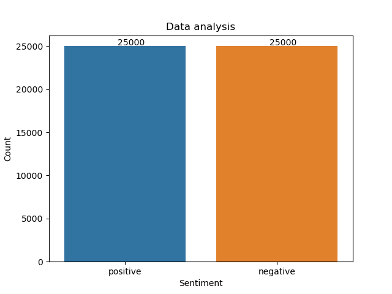
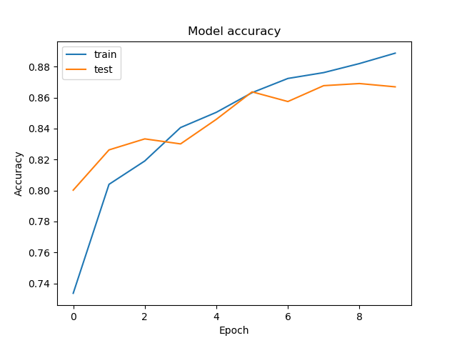
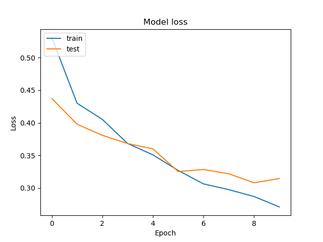
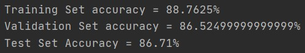

# Movie Sentiment Analysis
Movie Sentiment Analysis done on IMDB dataset using CuDNNLSTM (gpu accelerated LSTM)

# Table of Contents
- [Introduction](#introduction)
- [Dataset](#dataset)
- [Methodology](#methodology)
- [Installation](#installation)
- [Requirements](#requirements)
- [Results](#results)
- [References](#references)
- [Contribution](#contribution)

## Introduction
Movie Sentiment analysis is a classical problem in Machine Learning and classification which helps to learn the fundamentals of how text input can be used with ML models and Neural Nets to classify the sentiment of the input text.

## Dataset
The dataset used is **IMDB Dataset** which is included in the repo. Positive label for a review means that the review corresponding to it contains a positive sentiment and similarly for Negative labeled review.



glove.6B.100d.txt is used for embedding which can be downloaded from [_here_](https://nlp.stanford.edu/projects/glove/)

## Methodology
All the reviews were either positive or negative. The dataset was perfectly balanced as is shown in the below image. The dataset contained 50000 reviews with 2 columns (review, sentiment) where review is the given review for some movie and sentiment is the label given to it.

The given review text is pre processed to make the model better learn the task of classification and so as to remove not important words (words that does not help in classification)

Preprocessing performed:
1. Lower casing of review
2. Removed numbers
3. Removed tags
4. Removing all punctuations except '
5. Lemmatization and stop words removal

After performing all the steps described above, reviews are stored and saved in pickle files to avoid unncessary recomputation of all these steps.

Several pickle files are created at different steps to avoid long waiting time for tasks performed before training the actual model.
All the pickle files are made with the first run of the program, after that the model will train very quickly.

After pre-processing, dataset was split into train test with the ratio of 80:20 and then model was trained using the train set for the purpose of classification.

Model details  are:
1. Embedding Layer
2. CuDNNLSTM layer with 128 neurons
3. Dense layer (output layer) with single neuron and sigmoid activation function
4. Adam optimizer was used with accuracy as evaluation metrics

Model is evaluated against the test set.


Using gpu accelerated LSTM helped in very fast training of model (1-2 secs for each iteration) on a 4GB Nvidia Geforce GTX 1650. If any problem is faced while installing CUDA or you have an AMD card, just replace the statements containing CuDNNLSTM with LSTM and it will work just fine.

## Installation
```bash
python movie_sentiment_analysis.py
```

## Requirements
Following are the libraries required
* numpy
* random
* pickle
* matplotlib
* pandas
* seaborn
* sklearn
* nltk
* keras
* tensorflow
* tensorflow-gpu
* CUDA

## Results
The model accuracy and loss are plotted for easy inferences and interpretation of results

**Accuracy Plot**



**Loss Plot**



**Accuracy Summaries**



From the above results it is clear that the model is not overfitting as it has performed similar for train set and test set with all 3 accuracy close to each other. Also the model achieved accuracy of 88-89% which is pretty good.

_Note:_ The accuracies shown in the training GIF may be slightly different from the one shown in the plots as they were documented in 2 different runs.

## Contribution
Project was created by [Rahul Maheshwari](mailto:rahul19027@iiitd.ac.in). Feel free to contact me.
